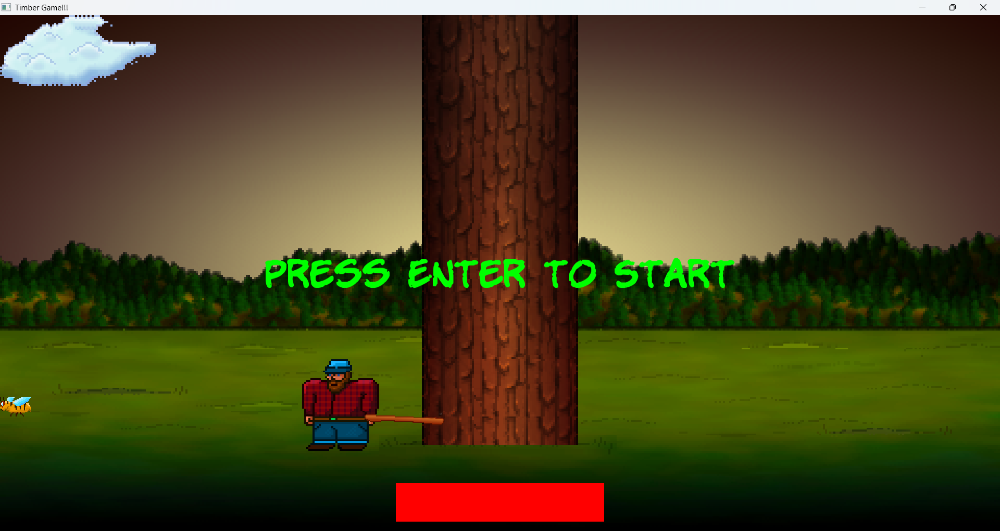
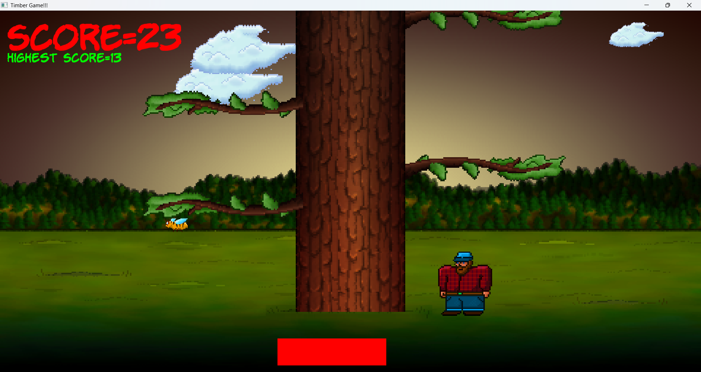
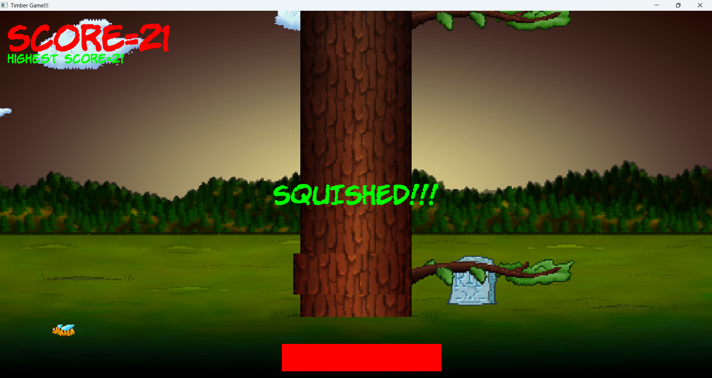
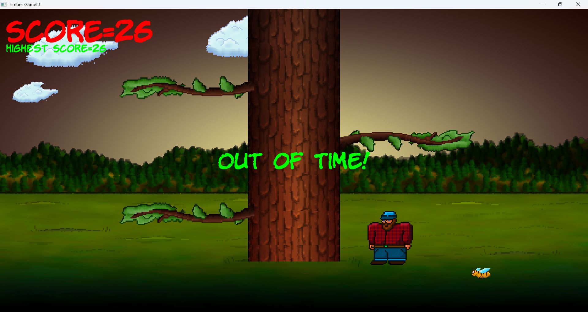

# TimberMan Game

A simple arcade game inspired by Timberman, developed using C++ and SFML. The player chops a tree while avoiding branches. The objective is to survive as long as possible and achieve the highest score.

---

## Gameplay

* The player stands on either side of a tree.
* Each key press chops the tree and shifts branches downward.
* New branches appear randomly at the top.
* If the player is on the same side as a branch, a collision occurs.
* The player loses a life on collision.
* The game ends when all lives are lost.

---

## Controls

| Key             | Action              |
| --------------- | ------------------- |
| Left Arrow      | Move left and chop  |
| Right Arrow     | Move right and chop |
| Enter           | Start the game      |
| Esc             | Exit the game       |

---

## Features

* Player side switching (left/right)
* Random branch generation
* Collision detection
* Lives system
* Score tracking
* Increasing difficulty over time

---

## Project Structure

```
TimberMan/
│── TimberMan.cpp
|── TimberMan.exe
│── assets/
│   ├── textures/
│   ├── fonts/
│   ├── sounds/
|   └── Screenshots/
│── README.md
```

---

## Build and Run

### Requirements

* C++ Compiler (g++)
* SFML Library

### Compile

```
g++ TimberMan.cpp -o TimberMan.exe -lsfml-graphics -lsfml-window -lsfml-system -lsfml-audio
```

### Run

```
./TimberMan.exe
```

---

## Notes

* Ensure SFML libraries are properly installed and linked.
* On Windows, required SFML DLL files must be present in the executable directory.
* Make sure assets (fonts, textures) are correctly loaded at runtime.

## Screenshots

### Start Screen


### Gameplay


### Game Over (Squished)


### Game Over (Out of Time)

---

## Author

Neelakantha Sahu

---

